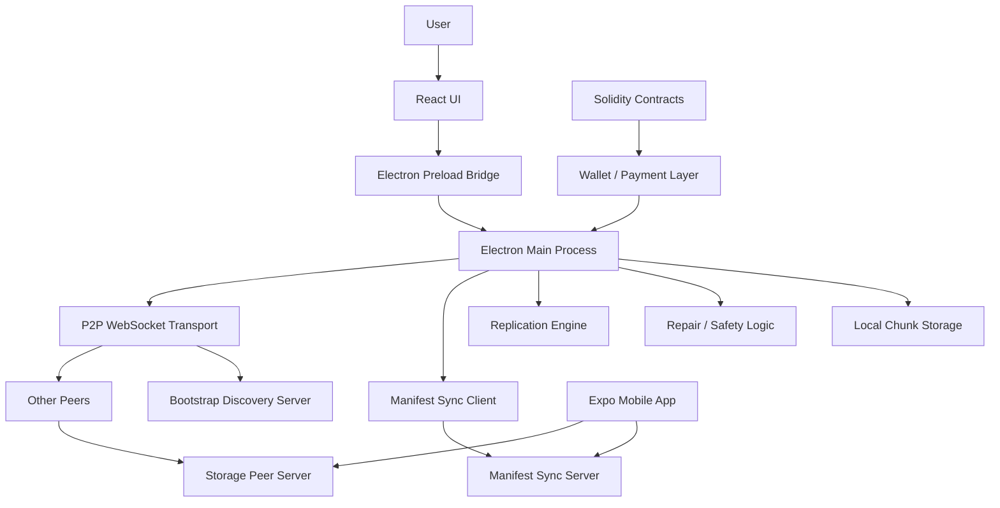
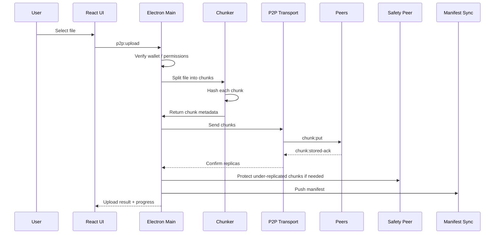
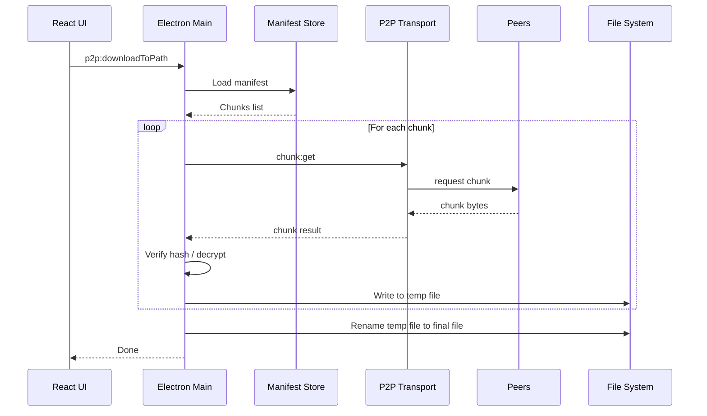
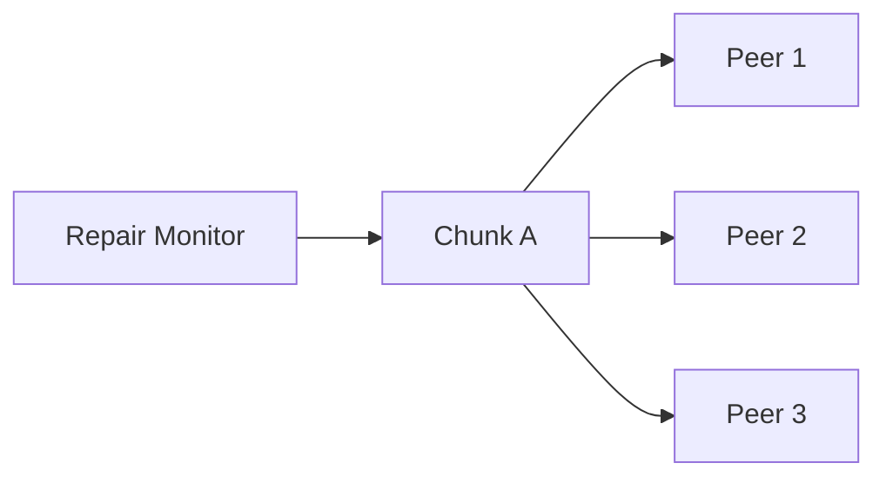

# المرجع

> هذا الملف هو المرجع الهندسي الحي لمشروع `p2p-cloud` على فرع `big-file-upload-safe`.
> أي تقنية، ميزة، إصلاح، أو قرار معماري جديد يجب توثيقه هنا حتى يبقى المشروع مفهومًا وقابلًا للتطوير بدون الاعتماد على الذاكرة أو المحادثات.

---

## 1. الهدف من المشروع

مشروع `p2p-cloud` هو تطبيق تخزين ملفات بنظام **Peer-to-Peer Cloud Storage** يعمل أساسًا كتطبيق سطح مكتب باستخدام Electron، ويهدف إلى توفير تجربة شبيهة بالسحابة التقليدية لكن بدون اعتماد كامل على خادم مركزي لتخزين الملفات.

الفكرة الأساسية:

- المستخدم يرفع ملفًا.
- التطبيق يقسم الملف إلى chunks.
- كل chunk يتم فحصه وتخزينه وتوزيعه على peers.
- يتم حفظ manifest يصف الملف والقطع الخاصة به.
- عند التنزيل، يتم إعادة تجميع chunks حسب manifest.
- توجد طبقات حماية مثل replication وrepair وsafety peer.
- توجد خطة لربط التخزين بالمحفظة والدفع والاشتراكات.

المشروع ليس مجرد واجهة. هو مزيج من:

- Electron Desktop App.
- React/Vite UI.
- WebSocket P2P transport.
- Bootstrap discovery server.
- Manifest sync server.
- Storage peer server.
- Mobile Expo app.
- Smart contracts للاشتراكات والخطط.
- Wallet/payment integration.
- أدوات patch/build/diagnostics كثيرة.

---

## 2. التقييم الهندسي الحالي

التقييم العام الحالي للمشروع: **6.8/10**.

التفصيل:

| المجال | التقييم |
|---|---:|
| الفكرة والمعمارية | 8.5/10 |
| P2P / الشبكة | 7/10 |
| رفع الملفات الكبيرة | 7.5/10 |
| الأمان والتشفير | 6.5/10 |
| نظافة الكود والتكامل | 5.5/10 |
| جاهزية المنتج للإطلاق العام | 5/10 |
| قابلية التحول إلى منتج قوي | 8/10 |

الخلاصة:

المشروع قوي كفكرة وكتجربة هندسية متقدمة، لكنه يحتاج جولة تنظيف وتثبيت معماري قبل الإطلاق العام. أكبر مشكلة ليست الفكرة، بل تراكم الـ patches، تفاوت بعض المسارات، وجود ملفات تشغيل ناقصة أو غير متطابقة، وتفاوت مستوى الأمان بين desktop/mobile/server.

---

## 3. المعمارية العامة

المعمارية الحالية يمكن فهمها بهذا الشكل:



### 3.1 Electron Main Process

هو مركز التحكم الحقيقي في نسخة سطح المكتب.

مسؤول عن:

- تشغيل التطبيق.
- فتح نافذة Electron.
- استقبال طلبات الواجهة عبر IPC.
- إدارة الرفع والتنزيل.
- تشغيل أو الاتصال بطبقة P2P.
- التعامل مع manifests.
- فرض wallet gating أو verification عند الحاجة.
- حماية الذاكرة عند الملفات الكبيرة.

### 3.2 React Renderer

واجهة المستخدم فقط.

يجب ألا تتعامل مباشرة مع:

- filesystem.
- network APIs خارج المسار المعتمد.
- HTTP fetch عشوائي للـ P2P.
- أسرار المستخدم.
- مفاتيح التشفير الخام.

المسار الصحيح أن تتواصل الواجهة مع Electron عبر preload bridge فقط.

### 3.3 Preload Bridge

طبقة الأمان بين React وElectron Main.

الدور:

- تعريض `window.electron.invoke` أو API مشابه.
- منع الواجهة من الوصول المباشر إلى Node.js.
- توحيد قنوات IPC مثل:
  - `p2p:start`
  - `p2p:listFiles`
  - `p2p:upload`
  - `p2p:download`
  - `p2p:delete`
  - `p2p:networkSummary`

أي API جديد يجب أن يمر من preload، وليس من fetch داخل الواجهة.

---

## 4. آلية عمل رفع الملف

### 4.1 المسار المنطقي



### 4.2 الخطوات

1. المستخدم يختار ملف.
2. الواجهة ترسل طلب رفع إلى Electron Main.
3. Electron يتحقق من حالة المستخدم أو المحفظة إذا كانت مطلوبة.
4. الملف يتم تقسيمه إلى chunks.
5. كل chunk يحصل على hash، غالبًا SHA-256.
6. يتم إرسال chunks إلى peers عبر WebSocket transport.
7. كل peer يستلم chunk ويرسل acknowledgment.
8. النظام يحسب عدد النسخ المؤكدة.
9. إذا كانت النسخ أقل من الهدف، يتم استخدام repair أو safety peer.
10. يتم حفظ manifest يصف الملف وchunks والملكية والحالة.

---

## 5. آلية عمل تنزيل الملف

### 5.1 المسار الصحيح للملفات الكبيرة

الملفات الكبيرة يجب ألا تعود كـ bytes ضخمة إلى React renderer.

المسار الأفضل:

- Electron Main يختار مسار حفظ الملف.
- يتم تنزيل chunks واحدًا تلو الآخر أو بتوازي مضبوط.
- يتم التحقق من hash لكل chunk.
- يتم فك التشفير إن وجد.
- تتم الكتابة إلى ملف مؤقت على القرص.
- بعد اكتمال التحقق يتم rename للملف النهائي.

هذا يمنع:

- انهيار الذاكرة.
- تجميد الواجهة.
- تلف الملف عند انقطاع التنزيل.

### 5.2 مخطط التنزيل



---

## 6. Manifest System

الـ manifest هو خريطة الملف.

يحتوي عادة على:

- file id.
- file name.
- file size.
- owner wallet/account.
- chunk hashes.
- chunk sizes.
- encryption metadata.
- replica status.
- folder/company drive metadata إذا موجود.

بدون manifest لا يمكن معرفة كيف يتم إعادة بناء الملف.

### 6.1 Manifest Sync Server

وظيفته مزامنة metadata، وليس تخزين الملفات نفسها.

يجب أن يحمي:

- الكتابة غير المصرح بها.
- replay attacks.
- تغيير owner.
- حذف manifests بدون صلاحية.

المسار الأفضل أمنيًا:

- كل تعديل manifest يجب أن يكون موقّعًا من wallet أو seed identity.
- HMAC وحده جيد كبداية لكنه ليس كافيًا لملكية المستخدمين العامة.

---

## 7. P2P Transport

المسار الفعلي الأوضح حاليًا هو WebSocket P2P، وليس libp2p الكامل.

### 7.1 مسؤوليات طبقة النقل

- فتح listener محلي.
- الاتصال بالـ bootstrap server.
- تسجيل peer public address.
- استقبال peers.
- إرسال واستقبال chunks.
- تطبيق backpressure.
- تطبيق rate limits.
- إدارة peer reputation.
- منع peer واحد من استهلاك الذاكرة أو الشبكة.

### 7.2 الرسائل المتوقعة

أمثلة منطقية:

- `hello`
- `chunk:put`
- `chunk:get`
- `chunk:stored-ack`
- `chunk:not-found`
- `peer:summary`
- `repair:request`

### 7.3 ملاحظة libp2p

يوجد مسار/ملف متعلق بـ libp2p، لكنه ليس ظاهرًا أنه المسار التشغيلي الأساسي. إذا كان الهدف استخدام libp2p فعلًا، يجب:

- إضافة dependencies الناقصة بوضوح.
- توحيد نقطة التشغيل.
- تحديد هل WebSocket transport هو المؤقت أم النهائي.
- إزالة المسار غير المستخدم إذا لن يتم استعماله.

---

## 8. Bootstrap Discovery

الـ bootstrap server ليس مخزن ملفات. وظيفته تعريف peers على بعض.

الآلية:

1. كل peer يشغل التطبيق.
2. يرسل عنوانه إلى bootstrap.
3. bootstrap يحتفظ بقائمة peers.
4. peer جديد يطلب القائمة.
5. يبدأ الاتصال المباشر أو شبه المباشر مع peers.

هذا يجعل الشبكة عالمية إذا كان:

- bootstrap server موجود على public IP.
- peers لديهم public reachable address أو relay/NAT traversal.
- المنافذ مفتوحة.
- التطبيق يعلن public URL صحيح.

---

## 9. Storage Peer

Storage peer هو عقدة تستقبل chunks وتحفظها.

مسؤول عن:

- استقبال chunk.
- التحقق من الحجم.
- التحقق من hash.
- حفظ chunk.
- الرد بـ acknowledgment.
- إرسال chunk عند الطلب.
- تطبيق rate limit.
- منع امتلاء القرص.

### 9.1 ملاحظات مهمة

- تخزين chunks كـ JSON/base64 مفهوم وسهل، لكنه ليس الأفضل للأداء.
- للأداء العالي يفضل لاحقًا تخزين binary raw chunks.
- يجب حماية delete بآلية توقيع قوية.
- يجب ألا يستطيع أي peer حذف chunk لا يملكه.

---

## 10. Replication وRepair

الهدف من replication هو ألا يعتمد الملف على جهاز واحد.

مثال:

- الملف يتقسم إلى 100 chunk.
- كل chunk مطلوب له 3 نسخ.
- إذا chunk لديه نسخة واحدة فقط، يعتبر under-replicated.
- repair engine يحاول نسخه إلى peers إضافيين.
- إذا فشل، safety peer يحميه مؤقتًا.

### 10.1 الحالة المثالية



### 10.2 Safety Peer

Safety peer هو حماية طوارئ.

ليس الهدف أن يصبح الخادم المركزي الرئيسي، بل:

- يحمي chunks ناقصة النسخ.
- يمنع فقدان البيانات أثناء ضعف الشبكة.
- يعطي الشبكة وقتًا لإصلاح نفسها.
- يمكن حذف نسخة safety peer عندما تكتمل النسخ الحقيقية.

---

## 11. التشفير

المسار الأمني المطلوب:

- تشفير الملف قبل مغادرة جهاز المستخدم.
- كل chunk مخزن على peers يكون encrypted.
- peers لا يعرفون محتوى الملف.
- manifest لا يحتوي أسرار فك التشفير بشكل مكشوف.
- مفاتيح فك التشفير مشتقة من wallet/seed/password بطريقة ثابتة وآمنة.

### 11.1 الوضع الحالي

يوجد استخدام واضح لفكرة:

- AES-GCM.
- PBKDF2-SHA256.
- salt.
- IV.
- auth tag.
- original hash.

هذا جيد كبداية.

### 11.2 المطلوب للتحسين

- توحيد التشفير بين desktop وmobile.
- منع اختلاف key derivation بين الأجهزة.
- إضافة wallet signature ownership.
- إضافة manifest encryption أو تقليل metadata المكشوفة.
- اختبار تنزيل ملف من جهاز ثاني بنفس wallet/seed.

---

## 12. Wallet وPayment Layer

المشروع يحتوي مسارات للربط بالمحفظة والاشتراكات.

الأهداف:

- ربط التخزين بالمحفظة.
- تحديد free tier.
- تفعيل خطط مدفوعة.
- منع رفع/تنزيل غير مصرح حسب الخطة.
- مستقبلاً إثبات الدفع عبر smart contracts.

### 12.1 الملاحظات الحالية

- Wallet gating جيد كمفهوم.
- PayPal path غير مكتمل إذا كان server/paypal-checkout.js فارغًا أو غير فعال.
- العقود موجودة لكن تحتاج توحيد نموذج الخطط والأسعار.
- لا يجب الاعتماد على UI فقط لتفعيل الخطة.
- التحقق يجب أن يكون في Electron Main/server وليس في React فقط.

---

## 13. Mobile App

يوجد تطبيق Expo mobile.

دوره الحالي:

- اختيار ملفات/صور.
- تشفير محلي.
- رفع chunks إلى storage peer.
- إرسال manifest.
- تنزيل وفك تشفير.

### 13.1 نقاط القوة

- وجود mobile path يعطي المشروع توسعًا مهمًا.
- التشفير واضح أكثر في mobile crypto layer.
- فكرة auto backup جيدة.

### 13.2 نقاط الضعف

- المسار الحالي يقرأ الملف كاملًا في الذاكرة.
- هذا خطر للملفات الكبيرة.
- لا يوجد streaming حقيقي كامل.
- لا يوجد resume upload/download قوي.
- Manifest sync authentication غير متوافق بوضوح إذا كان الخادم يطلب HMAC.

### 13.3 المطلوب

- streaming upload من الهاتف.
- chunk-by-chunk encryption بدل تشفير كامل الملف في الذاكرة.
- resumable queue.
- HMAC أو wallet signature لكل manifest write.
- background upload حقيقي.

---

## 14. التقنيات الأساسية

| التقنية | الدور | الملاحظة |
|---|---|---|
| Electron | تطبيق سطح المكتب وIPC والوصول للملفات | أساسي جدًا |
| React | واجهة المستخدم | يجب أن تبقى UI فقط |
| Vite | بناء الواجهة | مناسب وسريع |
| TypeScript | typing للواجهة والموبايل | مهم للنظافة |
| JavaScript Node.js | Electron/server scripts | مستخدم بكثافة |
| WebSocket/ws | P2P transport وstorage peer | المسار التشغيلي الأوضح |
| Express | Manifest sync server | مناسب كبداية |
| Helmet/CORS | حماية HTTP server | داعمة |
| Expo | Mobile app | جيد كبداية |
| AES-GCM | تشفير | مناسب إذا طبق صح |
| PBKDF2-SHA256 | اشتقاق مفاتيح | مقبول، ويمكن دراسة Argon2 لاحقًا |
| SHA-256 | Hash للقطع | أساسي للتحقق |
| Solidity | اشتراكات وخطط | يحتاج توحيد |
| WalletConnect/viem | Wallet integration | جيد لكن يحتاج تثبيت إنتاجي |
| electron-builder | تغليف Windows | مناسب |
| PM2 | تشغيل خوادم على VPS/EC2 | مناسب للمرحلة الحالية |

---

## 15. أهم المشاكل الحالية

### 15.1 تراكم patch scripts

وجود scripts كثيرة من نوع patch/fix يعني أن المشروع تطور بسرعة، لكن هذا يخلق خطرًا:

- صعوبة معرفة المصدر الحقيقي للمنطق.
- احتمال أن script يعدل ملفًا لم يعد مطابقًا.
- صعوبة تشغيل المشروع من الصفر.
- صعوبة onboarding لأي مطور جديد.

الحل:

- دمج كل patch ناجح داخل الملف الأصلي.
- حذف patches القديمة.
- ترك scripts فقط للتشغيل والبناء والتشخيص.

### 15.2 اختلاف الوثائق عن الكود

بعض الأوامر أو المسارات قد لا تطابق `package.json` أو الملفات الموجودة.

الحل:

- README واحد رسمي.
- RELEASE واحد محدث.
- هذا الملف `المرجع.md` يكون المصدر الهندسي الأعلى.

### 15.3 `.env` داخل المستودع

وجود `.env` في Git خطر حتى لو لم يحتوي أسرارًا حقيقية.

الحل:

- حذف `.env` من Git.
- إبقاء `.env.example` فقط.
- تدوير أي secrets كانت موجودة.
- التأكد من `.gitignore`.

### 15.4 PayPal path غير مكتمل

إذا كان `server/paypal-checkout.js` فارغًا أو ناقصًا، فلا يعتبر الدفع جاهزًا.

الحل:

- إما إكمال PayPal server.
- أو حذف المسار مؤقتًا.
- أو وضعه تحت experimental flag.

### 15.5 mobile غير جاهز للملفات الكبيرة

الموبايل يحتاج streaming حقيقي قبل اعتباره production للملفات الكبيرة.

---

## 16. قواعد التطوير من الآن فصاعدًا

أي إضافة جديدة يجب أن تتبع هذه القواعد:

1. لا تضف feature عن طريق patch دائم.
2. عدّل الملف الأصلي مباشرة.
3. أضف اختبار أو diagnostic واضح.
4. حدّث هذا الملف في قسم الملحق.
5. وثق:
   - ماذا أضفت؟
   - أين أضفت؟
   - لماذا؟
   - ما أثره على الأمان؟
   - ما أثره على الملفات الكبيرة؟
   - ما أثره على التوافق بين الأجهزة؟

---

## 17. خطة رفع المشروع إلى 9/10

### المرحلة الأولى: تثبيت التشغيل

- التأكد أن `pnpm install` يعمل من الصفر.
- التأكد أن `pnpm electron:dev` يعمل من الصفر.
- حذف أو إصلاح أي imports مفقودة.
- حذف scripts التي تشير إلى ملفات غير موجودة.
- توحيد README مع package.json.

### المرحلة الثانية: تنظيف المعمارية

- تحديد المسار الرسمي: WebSocket P2P أم libp2p.
- حذف المسار غير المستخدم أو وضعه تحت experimental.
- توحيد IPC channels.
- منع أي fetch مباشر من UI للـ P2P.
- فصل My Drive عن Company Drive بشكل نظيف.

### المرحلة الثالثة: حماية الملفات الكبيرة

- اعتماد `downloadToPath` كمسار رسمي.
- إضافة resumable upload sessions.
- إضافة temp files.
- إضافة checksum validation لكل chunk.
- اختبار 1GB و5GB و10GB.

### المرحلة الرابعة: الأمان

- حذف `.env` من Git.
- إضافة wallet-signed manifest writes.
- توحيد encryption model.
- منع delete بدون توقيع.
- إضافة threat model.

### المرحلة الخامسة: الشبكة العالمية

- تثبيت bootstrap public server.
- توثيق `P2P_PUBLIC_URL`.
- إضافة NAT traversal أو relay لاحقًا.
- إضافة peer scoring.
- إضافة auto repair background loop.

### المرحلة السادسة: المنتج

- UI نظيف شبيه Drive.
- onboarding واضح.
- installer مستقر.
- crash reporting اختياري.
- update mechanism.
- payment flow مكتمل.

---

## 18. Definition of Done لأي ميزة جديدة

الميزة لا تعتبر مكتملة إلا إذا تحقق التالي:

- تعمل بعد clone جديد.
- لا تعتمد على patch قديم.
- موثقة في هذا الملف.
- لها test أو manual verification واضح.
- لا تكسر upload/download.
- لا تفتح ثغرة في wallet/auth.
- لا تزيد استهلاك الذاكرة للملفات الكبيرة.
- تعمل بعد restart للتطبيق.

---

## 19. ملحق التحديثات

### 2026-05-27 — إنشاء المرجع الهندسي الأول

تم إنشاء هذا الملف ليكون مرجعًا حيًا للمشروع.

يشمل:

- شرح الهدف العام.
- شرح المعمارية.
- شرح آلية الرفع والتنزيل.
- شرح P2P transport.
- شرح bootstrap وmanifest sync وstorage peer.
- شرح replication وrepair وsafety peer.
- شرح التشفير والمحفظة والدفع.
- تحديد أهم المشاكل.
- وضع خطة للوصول إلى 9/10.

أي تحديث لاحق يجب أن يضاف أسفل هذا القسم بنفس الصيغة:

```md
### 2026.05.28 — عنوان التغيير

- الملفات المعدلة:
- ماذا تغير:
- لماذا تغير:
- أثره على الأمان:
- أثره على الملفات الكبيرة:
- طريقة الاختبار:
```
