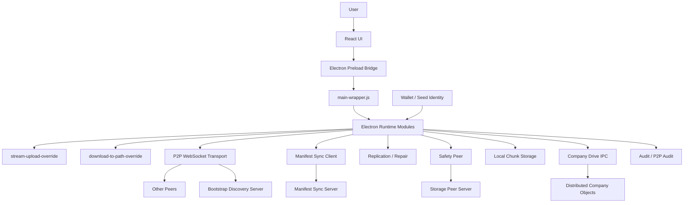
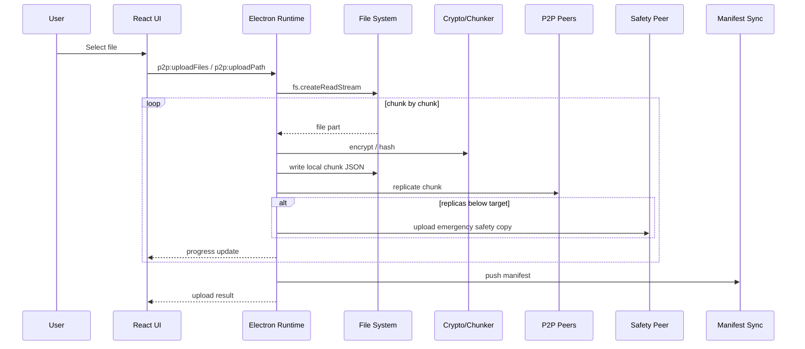
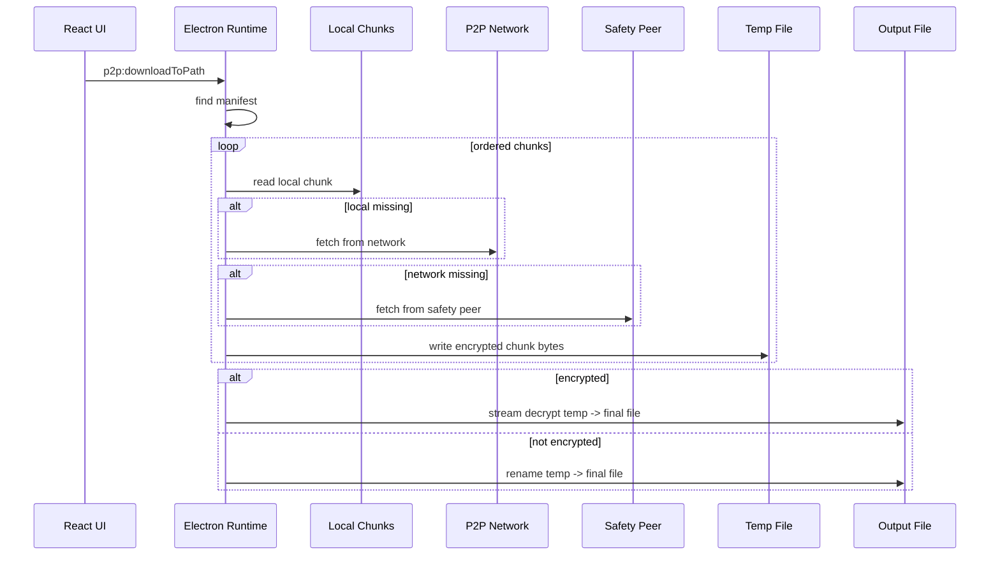
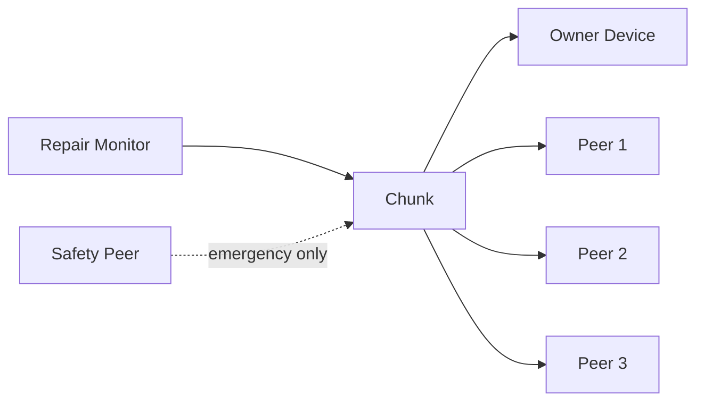

# المرجع

> هذا الملف هو المرجع الهندسي الحي لمشروع `p2p-cloud` / `Chunknet` على فرع `big-file-upload-safe`.
> أي تقنية، ميزة، إصلاح، أو قرار معماري جديد يجب توثيقه هنا حتى يبقى المشروع مفهومًا وقابلًا للتطوير بدون الاعتماد على الذاكرة أو المحادثات.

آخر تحديث موثق: **2026-05-30**.

---

## 1. الهدف من المشروع

مشروع `p2p-cloud` هو تطبيق تخزين ملفات بنظام **Peer-to-Peer Cloud Storage** يعمل أساسًا كتطبيق سطح مكتب باستخدام Electron، ويهدف إلى توفير تجربة شبيهة بالسحابة التقليدية لكن بدون اعتماد كامل على خادم مركزي لتخزين الملفات.

الفكرة الأساسية:

- المستخدم يرفع ملفًا.
- التطبيق يقسم الملف إلى chunks.
- كل chunk يتم فحصه وتشفيره وتخزينه وتوزيعه على peers.
- يتم حفظ manifest يصف الملف والقطع الخاصة به.
- عند التنزيل، يتم إعادة تجميع chunks حسب manifest.
- توجد طبقات حماية مثل replication وrepair وsafety peer.
- توجد طبقة هوية عبر wallet أو seed account.
- توجد خطة ربط التخزين بالدفع والاشتراكات.
- توجد Company Drive منفصلة عن My Drive مع roles وinvites وaudit.

المشروع ليس مجرد واجهة. هو مزيج من:

- Electron Desktop App.
- React/Vite UI.
- WebSocket P2P transport.
- Bootstrap discovery server.
- Manifest sync server.
- Storage peer / safety peer server.
- Encryption pipeline.
- Replication / repair / protection retry logic.
- Wallet / Seed identity.
- Company Drive وshared links وfolders.
- Verify/build/release guards.
- Mobile Expo path موجود لكنه ليس مسار الإنتاج الأساسي للملفات الكبيرة حاليًا.

---

## 2. التقييم الهندسي الحالي

التقييم العام الحالي للمشروع بعد مراجعة المسار التشغيلي الفعلي: **8.4/10**.

هذا التقييم يصحح التقييم القديم `6.8/10` الذي كان يعتمد أكثر على حالة تاريخية وعلى مشاكل تم تجاوزها جزئيًا في المسار الحالي.

| المجال | التقييم الحالي |
|---|---:|
| الفكرة والمعمارية | 9.2/10 |
| Electron runtime / IPC | 8.6/10 |
| P2P / الشبكة | 8.2/10 |
| رفع الملفات الكبيرة | 8.7/10 |
| تنزيل الملفات الكبيرة | 8.4/10 |
| Replication / Safety peer | 8.3/10 |
| الأمان والتشفير | 8/10 |
| Company Drive | 8/10 |
| Verify / CI / release guards | 8.5/10 |
| نظافة الكود والتكامل | 7.4/10 |
| جاهزية المنتج للمستخدم العادي | 7.2/10 |
| قابلية الوصول إلى 9/10 | عالية جدًا |

الخلاصة الحالية:

المشروع صار أقرب إلى منتج تقني حقيقي وليس مجرد تجربة. أقوى ما فيه الآن هو انتقاله إلى مسار **disk-first streaming** للرفع والتنزيل، وجود runtime واضح عبر `main-wrapper.js`، وجود guards كثيرة قبل البناء، ووجود P2P transport فيه health/reputation/routing وليس WebSocket بسيط فقط.

سبب عدم إعطائه 9/10 الآن ليس ضعف الفكرة أو التنفيذ، بل وجود بقايا هندسية يجب تنظيفها:

- وجود أكثر من مصدر لبعض الثوابت مثل chunk size وtarget replicas بين `main.js` و`electron/core/config.js`.
- اعتماد runtime على override modules كثيرة بدل دمجها نهائيًا داخل ملفات رسمية منظمة.
- تخزين chunks بصيغة JSON/base64 لا يزال مناسبًا للتطوير لكنه ليس أفضل أداء من binary raw chunk storage.
- Company Drive وsignature validation يحتاجان smoke test قوي بين أكثر من جهاز.
- payment path يحتاج إغلاق إنتاجي كامل قبل البيع العام.

---

## 3. المعمارية العامة

المعمارية الحالية يمكن فهمها بهذا الشكل:



### 3.1 Electron Main / Wrapper

المسار التشغيلي الحالي يدور حول `electron/main-wrapper.js`.

هذا الملف يقوم بتجهيز بيئة التشغيل ثم يستورد runtime modules مثل:

- `p2p-transport-global-registry.js`
- `p2p-delete-message-override.js`
- `wallet-plan-guard.js`
- `main-stable.js` أو fallback إلى `main.js`
- `list-files-normalize-ipc.js`
- `network-summary-normalize-ipc.js`
- `company-workspace-ipc.js`
- `company-join-workspace-ipc.js`
- `company-offline-invite-ipc.js`
- `company-distributed-objects-ipc.js`
- `shared-link-ipc.js`
- `file-update-ipc.js`
- `folder-item-ipc.js`
- `folder-crud-ipc.js`
- `folder-tree-normalize-ipc.js`
- `ui-prefs-ipc.js`
- `protected-upload-override.js`
- `transfer-cancel-ipc.js`
- `stream-upload-override.js`
- `protection-retry-loop.js`
- `download-to-path-override.js`
- `hard-delete-override.js`
- `delete-tombstone-sync.js`
- `tombstone-sync-pull-override.js`

هذا يجعل `main-wrapper.js` هو نقطة تشغيل مهمة جدًا ويجب اعتباره حاليًا runtime entrypoint الفعلي.

### 3.2 React Renderer

الواجهة هي UI فقط، ويجب أن تبقى كذلك.

قواعد مهمة:

- لا وصول مباشر إلى filesystem.
- لا HTTP fetch عشوائي إلى خدمات P2P/storage/payment.
- لا حفظ أسرار أو مفاتيح خام في React.
- أي عملية privileged تمر عبر preload وIPC.
- الملفات الكبيرة لا تعود إلى React كـ Buffer أو Base64.

### 3.3 Preload Bridge

Preload هو طبقة الأمان بين React وElectron Main.

قواعده:

- لا expose غير محدود لـ `ipcRenderer.invoke`.
- كل قناة IPC يجب أن تكون معرفة في contract.
- أي channel جديد يضاف أولًا إلى `electron/ipc-contract.cjs`.
- يجب تشغيل `pnpm verify:ipc` بعد أي إضافة أو إعادة تسمية channel.

---

## 4. آلية رفع الملفات الحالية

### 4.1 المسار الحديث للرفع

المسار الحالي المعتمد للرفع هو `electron/stream-upload-override.js`.

نقاط القوة:

- يستخدم `fs.createReadStream` بدل قراءة الملف كاملًا في الذاكرة.
- يقرأ الملف chunk-by-chunk.
- يحسب hash لكل chunk.
- يشفر البيانات عبر AES-GCM عندما يكون الملف private.
- يكتب chunk محليًا على القرص.
- يحاول replication على peers.
- إذا لم يكتمل target replicas، يستخدم safety peer كحماية طوارئ.
- يحدّث transfer progress.
- يدعم cancel rollback للـ chunks التي بدأت بالرفع.
- يدفع manifest بعد اكتمال الرفع.



### 4.2 سياسة replicas الحالية

القيمة الرسمية الحديثة يجب أن تكون:

- `TARGET_REPLICAS = 4`
- safety peer يستخدم كطوارئ إذا كانت P2P replicas أقل من الهدف.
- إذا توفر عدد كافٍ من peers لاحقًا، يجب أن تتحول الحماية إلى P2P حقيقية ويتم تنظيف safety copy عند اكتمال النسخ.

مهم جدًا:

- يجب توحيد `TARGET_REPLICAS` في `electron/core/config.js`.
- يجب إزالة أو تحييد أي default قديم في `main.js` يقول 3 بدل 4.

---

## 5. آلية تنزيل الملفات الحالية

المسار الحالي المعتمد للتنزيل هو `electron/download-to-path-override.js`.

نقاط القوة:

- يستخدم `p2p:downloadToPath` بدل إعادة bytes ضخمة إلى React.
- يبحث عن manifest حسب identity.
- يقرأ chunks محليًا أولًا.
- إذا لم يجد chunk محليًا، يحاول الشبكة.
- إذا فشل الشبكة، يحاول safety peer.
- يكتب chunks إلى temp file.
- إذا كان الملف encrypted، يفك التشفير عبر stream pipeline إلى الملف النهائي.
- يحذف temp file بعد النجاح أو الفشل.



### 5.1 ملاحظة مهمة

التنزيل الحالي جيد لأنه يمنع انهيار الذاكرة، لكنه يمكن أن يتحسن أكثر عبر:

- parallel chunk fetch مع الحفاظ على ترتيب الكتابة.
- checksum validation صريح لكل chunk قبل الكتابة النهائية.
- resume download عند الانقطاع.
- progress/cancel للتنزيل بنفس قوة الرفع.

---

## 6. Manifest System

الـ manifest هو خريطة الملف.

يحتوي عادة على:

- file id.
- file name.
- file size.
- stored size.
- owner wallet/account/seed identity.
- chunk hashes.
- chunk sizes.
- encryption metadata.
- replica status.
- protection mode.
- folder/company drive metadata.
- upload/update timestamps.

بدون manifest لا يمكن معرفة كيف يتم إعادة بناء الملف.

### 6.1 قواعد manifest الحديثة

- أي manifest write/delete يجب أن يكون محميًا.
- HMAC جيد كبداية للخادم، لكن الملكية العامة الأفضل تكون عبر wallet/seed signature.
- Manifest metadata لا يجب أن يحتوي secrets.
- يجب حماية delete من أي peer غير مصرح.
- folder/company metadata يجب أن تكون قابلة للمزامنة بين الأجهزة، وليست localStorage فقط.

---

## 7. P2P Transport

المسار الفعلي الحالي هو WebSocket P2P Transport.

هذا ليس مجرد socket بسيط. الطبقة الحالية تحتوي على:

- WebSocket server/listener.
- peer sockets map.
- peer info.
- peer health.
- peer reputation store.
- local chunk map + disk chunk store.
- pending chunk requests.
- pending chunk acknowledgments.
- token bucket bandwidth limits.
- max peers limits.
- route scoring.
- healthy replica selection.
- storage capacity inspection.

### 7.1 مسؤوليات طبقة النقل

- فتح listener محلي.
- الاتصال بالـ bootstrap server.
- تسجيل public peer URL.
- استقبال peers.
- إرسال واستقبال chunks.
- تطبيق backpressure.
- تطبيق rate limits.
- إدارة peer reputation.
- منع peer واحد من استهلاك الذاكرة أو الشبكة.
- اختيار replica targets حسب الصحة والضغط.

### 7.2 الرسائل المتوقعة

أمثلة:

- `peer:hello`
- `transport:ready`
- `chunk:put`
- `chunk:get`
- `chunk:found`
- `chunk:not-found`
- `chunk:stored-ack`
- `chunk:delete`
- `peer:summary`

### 7.3 ملاحظة libp2p

يوجد تاريخيًا مسار متعلق بـ libp2p، لكن المسار التشغيلي الواضح حاليًا هو WebSocket transport.

القرار الهندسي الحالي:

- إما اعتماد WebSocket رسميًا كمرحلة إنتاج أولى.
- أو نقل المشروع لاحقًا إلى libp2p بشكل واضح ومكتمل.
- لا يجب ترك مسارين متنافسين بدون قرار.

---

## 8. Bootstrap Discovery

الـ bootstrap server ليس مخزن ملفات. وظيفته تعريف peers على بعض.

الآلية:

1. كل peer يشغل التطبيق.
2. يرسل عنوانه إلى bootstrap.
3. bootstrap يحتفظ بقائمة peers.
4. peer جديد يطلب القائمة.
5. يبدأ الاتصال المباشر أو شبه المباشر مع peers.

حتى تصبح الشبكة عالمية فعلًا، يجب توفر:

- bootstrap server ثابت على public IP.
- public URL صحيح لكل peer أو relay/NAT traversal.
- فتح المنافذ اللازمة.
- توثيق `P2P_PUBLIC_URL`.
- لاحقًا: NAT traversal / relay / TURN-like path حسب الحاجة.

---

## 9. Storage Peer / Safety Peer

Storage peer هو عقدة تستقبل chunks وتحفظها.

المسؤوليات:

- استقبال chunk.
- التحقق من hash.
- التحقق من base64.
- التحقق من size.
- رفض chunk أكبر من الحد.
- حفظ chunk على disk.
- حفظ index.
- إرسال chunk عند الطلب.
- تطبيق rate limits.
- حماية delete عبر admin token.

### 9.1 نقاط قوة حالية

- `storage-peer.js` يتحقق من SHA-256 hash.
- يرفض chunk mismatch.
- يرفض chunk size mismatch.
- يفرض rate limit على put/get/delete.
- delete disabled إلا إذا تم ضبط admin token.
- يسجل نفسه مع bootstrap.

### 9.2 تحسينات لاحقة

- استبدال JSON/base64 بتخزين binary raw chunks لأداء أعلى.
- إضافة signed delete بدل admin token فقط.
- إضافة per-owner quota على storage peer.
- إضافة garbage collection للـ orphan chunks.
- إضافة storage proof / challenge لاحقًا.

---

## 10. Replication وRepair

الهدف من replication هو ألا يعتمد الملف على جهاز واحد.

الحالة المطلوبة:

- كل chunk يجب أن يستهدف 4 replicas.
- إذا replicas أقل من 4، يعتبر under target.
- safety peer يحمي chunk مؤقتًا.
- repair engine يحاول نسخ chunk إلى peers حقيقيين.
- عندما تصل replicas الحقيقية إلى الهدف، يتم حذف نسخة safety peer.



### 10.1 حماية الطوارئ

Safety peer ليس الهدف أن يصبح التخزين المركزي الرئيسي.

دوره:

- حماية chunks ناقصة النسخ.
- منع فقدان البيانات أثناء ضعف الشبكة.
- إعطاء الشبكة وقتًا لإصلاح نفسها.
- حذف نسخة safety عندما تكتمل النسخ الحقيقية.

---

## 11. التشفير

المسار الأمني الحالي:

- تشفير الملف قبل مغادرة جهاز المستخدم.
- تخزين chunks مشفرة على peers.
- peers لا يعرفون محتوى الملف.
- manifest يحتوي metadata اللازمة لفك التشفير، وليس كلمة السر.
- المفتاح يشتق من identity + drive password + salt.

التقنيات الحالية:

- AES-256-GCM.
- PBKDF2-SHA256.
- KDF iterations: 310,000.
- salt.
- IV.
- auth tag.
- original hash.
- minimum drive password length: 12.

### 11.1 المطلوب أمنيًا قبل الإنتاج العام

- توحيد encryption path بين كل المسارات.
- منع أي encryption legacy path غير مستخدم.
- اختبار cross-device recovery بنفس seed/wallet وdrive password.
- اختبار wrong password failure.
- اختبار manifest tampering.
- دراسة Argon2id مستقبلًا بدل PBKDF2 أو كخيار أقوى.

---

## 12. Wallet / Seed / Payment Layer

المشروع يحتوي مسارين للهوية:

- Wallet identity.
- Seed account identity.

المطلوب:

- لا يسمح برفع أو إدارة ملفات بدون identity verified.
- paid plan unlock لا يعتمد على UI فقط.
- quota enforcement يتم في Electron Main/server.
- wallet login signature لها مدة صلاحية.
- seed account يحتاج lockout/cooldown وحماية من brute force.

### 12.1 خطط التخزين الحالية

الخطط الموجودة في config:

- Free: 5 GB.
- 1 TB: $1.
- 3 TB: $2.5.
- 7 TB: $4.99.
- 10 TB: $7.99.

الخطط المدفوعة يجب أن تبقى locked إلى أن يكون payment proof/plan unlock آمن وموقع.

---

## 13. Company Drive

Company Drive هو workspace منفصل عن My Drive.

المتطلبات:

- Company Drive لا يندمج مع My Drive.
- كل workspace له `workspaceId`.
- roles تشمل:
  - owner
  - admin
  - manager
  - editor
  - viewer
  - guest
- owner/admin/manager يمكنهم الإدارة حسب الصلاحيات.
- editor يمكنه upload حسب السياسة.
- viewer/guest محدودون.
- invite member.
- join workspace.
- offline invite.
- import workspace access.
- company folders.
- company files.
- hidden/deleted flags.
- audit trail.

### 13.1 حالة Company Drive الحالية

الكود يحتوي قنوات UI/IPC واضحة لـ:

- `company:state`
- `company:deviceIdentity`
- `company:createWorkspace`
- `company:inviteMember`
- `company:joinWorkspace`
- `company:changeMemberRole`
- `company:removeMember`
- `company:addFile`
- `company:updateFile`
- `company:createFolder`
- `company:updateFolder`
- `company:deleteFolder`

### 13.2 ملاحظة Signature invalid

إذا ظهر `Signature invalid` في UI، فهذا لا يعني أن الفكرة فاشلة، بل يعني غالبًا وجود mismatch في:

- workspace signature payload.
- ترتيب الحقول وقت التوقيع.
- canonical JSON.
- owner identity.
- imported workspace token.
- تغير workspace بعد التوقيع بدون إعادة توقيع.

هذا يحتاج اختبار محدد:

1. إنشاء workspace جديد.
2. دعوة عضو offline.
3. الانضمام من جهاز ثاني.
4. التأكد أن نفس workspace يقرأ بتوقيع صحيح.
5. تغيير role وإعادة التحقق.
6. restart للجهازين.

---

## 14. Audit Log

يوجد مساران:

- local audit log.
- P2P replicated audit objects.

المسار الأفضل هو P2P audit لأنه يحول أحداث الشركة إلى objects/manifests قابلة للتوزيع.

أحداث يجب تسجيلها:

- upload.
- download.
- delete.
- move.
- rename.
- folder create/update/delete.
- invite member.
- change role.
- remove member.
- join workspace.

ملاحظات أمنية:

- لا تحفظ password/secret/seed/token في audit details.
- audit history للشركة يفضل أن يكون append-only.
- clear يجب أن يكون local cache فقط وليس حذف التاريخ الموزع.

---

## 15. Folders / UI State

المطلوب للـ folders:

- create folder.
- nested folders.
- rename folder.
- move folder/file.
- delete folder مع قرار مصير الملفات.
- folder tree ثابت عبر الأجهزة.
- My Drive folders منفصلة عن Company Drive folders.
- expanded folders يمكن مزامنتها كـ UI prefs.

ممنوع الاعتماد على localStorage فقط لأي metadata أساسي مثل:

- folder ownership.
- folder parent.
- file folder.
- company workspace structure.

localStorage مسموح فقط لتفضيلات UI غير حرجة مثل active workspace أو expanded folders إذا كان لها sync path بديل.

---

## 16. Verify / CI / Release Path

المشروع يحتوي verify pipeline قوي.

الأوامر المهمة:

- `pnpm audit:secrets`
- `pnpm security:scan`
- `pnpm production:scan`
- `pnpm verify:ipc`
- `pnpm verify:renderer`
- `pnpm verify:large-files`
- `pnpm verify:manifest-auth`
- `pnpm verify:storage-peer`
- `pnpm verify:bootstrap`
- `pnpm verify:wallet-payment`
- `pnpm verify:encryption`
- `pnpm verify:release`
- `pnpm verify:smoke-plan`
- `node scripts/verify-runtime.cjs`

`pnpm prepare:final` و`pnpm verify` يجب أن يبقيا gate أساسي قبل أي build.

GitHub Actions يجب أن يستمر بتشغيل:

- Node.js 22.13.0.
- pnpm 10.33.2.
- install.
- all verify scripts.
- renderer build.

---

## 17. أهم المشاكل الحالية

### 17.1 توحيد config

المصدر الرسمي للثوابت يجب أن يكون:

```bash
electron/core/config.js
```

يجب تنظيف أي defaults قديمة داخل `main.js` مثل:

- `CHUNK_SIZE_BYTES = 1MB`
- `TARGET_REPLICAS = 3`

والاعتماد فقط على:

- `CHUNK_SIZE_BYTES = 2MB` أو env override.
- `TARGET_REPLICAS = 4` أو env override.

### 17.2 تقليل override architecture

وجود override modules كان مفيدًا للوصول بسرعة إلى نسخة عاملة، لكنه لا يجب أن يبقى الشكل النهائي.

المطلوب:

- دمج upload/download/folder/company/delete logic داخل runtime modules رسمية.
- إزالة أسماء override من المسار النهائي تدريجيًا.
- إبقاء scripts التشخيص فقط.

### 17.3 JSON/base64 chunk storage

الوضع الحالي يعمل ومفهوم، لكنه يزيد الحجم والـ CPU overhead.

المطلوب لاحقًا:

- تخزين chunk binary raw.
- metadata منفصلة.
- index منفصل.
- migration من JSON chunks إلى binary chunks.

### 17.4 `.env` داخل Git

وجود `.env` داخل Git خطر حتى لو لم يحتوي أسرارًا حقيقية.

المطلوب:

- حذف `.env` من Git tracking.
- إبقاء `.env.example` فقط.
- تدوير أي secrets كانت موجودة.
- التأكد من `.gitignore`.

### 17.5 Payment production readiness

لا يعتبر payment جاهزًا للبيع إلا إذا:

- PayPal/server path مكتمل.
- paid plan unlock signed.
- quota enforcement في Electron/server.
- لا يوجد bypass من React.
- sandbox smoke test ناجح.

---

## 18. خطة رفع المشروع إلى 9/10

### المرحلة الأولى: تنظيف المسار الرسمي

- توحيد config.
- إزالة defaults القديمة.
- تحديد entrypoint الرسمي.
- تقليل override naming.
- توثيق runtime modules.

### المرحلة الثانية: تثبيت الملفات الكبيرة

- اختبار 1GB و5GB و10GB.
- download progress/cancel.
- resumable upload.
- resumable download.
- checksum validation قبل final write.

### المرحلة الثالثة: الشبكة العالمية

- bootstrap public server ثابت.
- توثيق `P2P_PUBLIC_URL`.
- relay/NAT traversal لاحقًا.
- peer scoring أقوى.
- repair loop يرفع replicas إلى 4 تلقائيًا.

### المرحلة الرابعة: Company Drive

- إصلاح أي سبب لـ `Signature invalid`.
- smoke test لجهازين.
- offline invite test.
- role change test.
- audit distributed test.
- move/copy from My Drive to Company Drive مع وضوح السلوك.

### المرحلة الخامسة: الإنتاج

- installer مستقر.
- firewall rule عند الحاجة.
- auto-start اختياري.
- crash reporting اختياري.
- auto-update.
- payment production.
- documentation للمستخدم النهائي.

---

## 19. Definition of Done لأي ميزة جديدة

الميزة لا تعتبر مكتملة إلا إذا تحقق التالي:

- تعمل بعد clone جديد.
- لا تعتمد على patch قديم غير موثق.
- موثقة في هذا الملف.
- لها test أو manual verification واضح.
- لا تكسر upload/download.
- لا تفتح ثغرة في wallet/auth.
- لا تزيد استهلاك الذاكرة للملفات الكبيرة.
- تعمل بعد restart للتطبيق.
- تعمل على الأقل بين جهازين إذا كانت network/company feature.
- تمر عبر `pnpm verify` أو يوجد سبب واضح إذا لم تدخل verify بعد.

---

## 20. أوامر التشغيل المهمة

### تثبيت

```bash
pnpm install
```

### تشغيل desktop dev

```bash
pnpm electron:dev
```

### فحص شامل

```bash
pnpm verify
```

### فحص عميق

```bash
pnpm health
pnpm health:deep
```

### بناء Windows

```bash
pnpm build
```

أو:

```bash
pnpm package:win
```

---

## 21. ملحق التحديثات

### 2026-05-27 — إنشاء المرجع الهندسي الأول

تم إنشاء هذا الملف ليكون مرجعًا حيًا للمشروع.

شمل:

- شرح الهدف العام.
- شرح المعمارية.
- شرح آلية الرفع والتنزيل.
- شرح P2P transport.
- شرح bootstrap وmanifest sync وstorage peer.
- شرح replication وrepair وsafety peer.
- شرح التشفير والمحفظة والدفع.
- تحديد أهم المشاكل.
- وضع خطة للوصول إلى 9/10.

### 2026-05-30 — تحديث التقييم والمسار التشغيلي الحالي

- تم تصحيح التقييم العام من **6.8/10** إلى **8.4/10** بعد مراجعة الكود التشغيلي الحالي.
- تم توثيق أن `main-wrapper.js` هو نقطة تشغيل مهمة للمسار الحالي.
- تم توثيق مسار `stream-upload-override.js` كمسار upload حديث يعتمد على disk-first streaming.
- تم توثيق مسار `download-to-path-override.js` كمسار download حديث يكتب إلى temp file ويفك التشفير عبر stream.
- تم توثيق أن `TARGET_REPLICAS` المطلوب حاليًا هو 4.
- تم توثيق دور safety peer كحماية طوارئ وليس تخزين مركزي دائم.
- تم توثيق قوة P2P transport الحالية: peer health, reputation, route score, bandwidth/rate limits, storage capacity.
- تم توثيق أن storage peer يتحقق من hash/size/base64 ويحتاج admin token للحذف.
- تم توثيق حالة Company Drive وسبب محتمل لرسالة `Signature invalid`.
- تم توثيق audit المحلي وP2P replicated audit.
- تم توثيق أن أهم تنظيف مطلوب الآن هو توحيد config وتقليل override architecture وتحسين chunk storage.

### قالب أي تحديث قادم

```md
### YYYY-MM-DD — عنوان التغيير

- الملفات المعدلة:
- ماذا تغير:
- لماذا تغير:
- أثره على الأمان:
- أثره على الملفات الكبيرة:
- أثره على التوافق بين الأجهزة:
- طريقة الاختبار:
```
